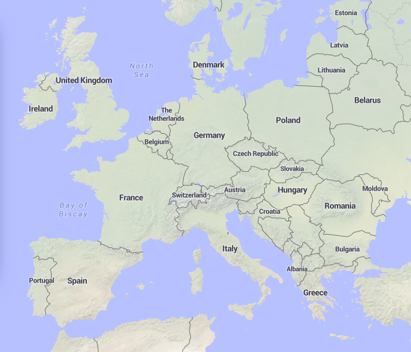
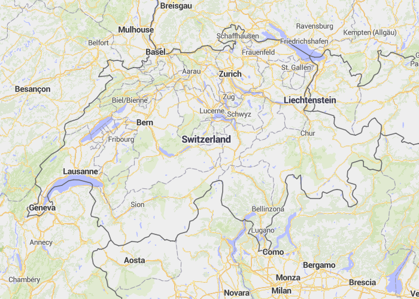
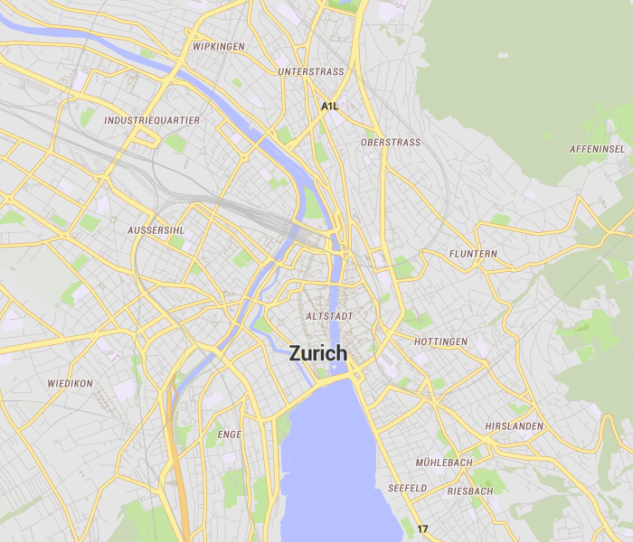
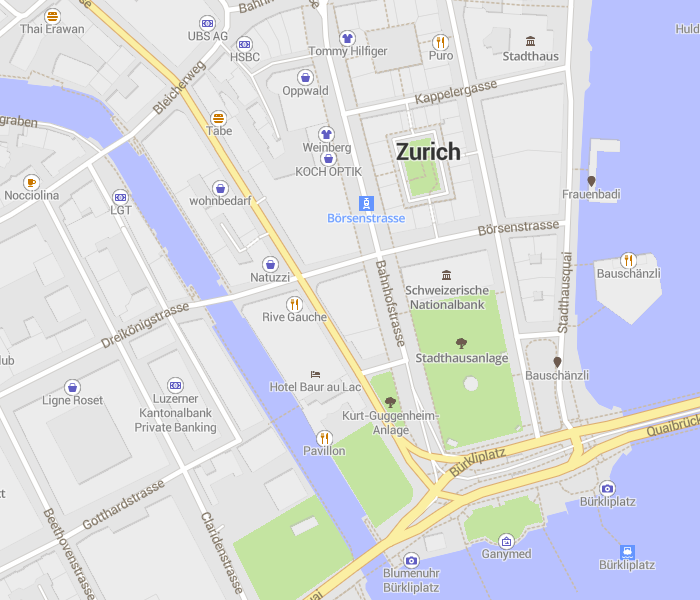

# OSM Liberty [](https://github.com/lukasmartinelli/osm-liberty/blob/gh-pages/LICENSE.md)


A free Mapbox GL basemap from [OpenStreetMap](https://openstreetmap.org) with complete liberty to use and self host. OSM Liberty is a fork of OSM Bright based on free data sources with a mission for a clear good looking design for the everyday user.

**[osm-liberty.lukasmartinelli.ch](http://osm-liberty.lukasmartinelli.ch/)**

## Usage

You can instantly use the style in your Mapbox GL maps. The vector tiles are served from the @klokantech public CDN
and the raster tiles, glyphs and sprites directly from GitHub.
Take a look at the [demo page source code](index.html) how to display a map.
To use it you don't need any access keys and you can host the tiles and assets yourself for complete liberty.

```html
<!DOCTYPE html>
<html>
<head>
  <meta charset=utf-8 />
  <title>OSM Liberty</title>
  <meta name='viewport' content='initial-scale=1,maximum-scale=1,user-scalable=no' />
  <style>
    body { margin:0; padding:0; }
    #map { position:absolute; top:0; bottom:0; width:100%; }
  </style>
  <script src='https://api.tiles.mapbox.com/mapbox-gl-js/v0.21.0/mapbox-gl.js'></script>
  <link href='https://api.tiles.mapbox.com/mapbox-gl-js/v0.21.0/mapbox-gl.css' rel='stylesheet' />
</head>
<body>
  <div id='map'></div>
  <script>
  var map = new mapboxgl.Map({
      container: 'map',
      style: 'http://osm-liberty.lukasmartinelli.ch/osm-liberty.json',
      center: [8.538961,47.372476],
      zoom: 5,
      hash: true
  });
  </script>
</body>
</html>
```

## Data Sources

- [OSM2VectorTiles](http://osm2vectortiles.org/) as vector data source
- [Natural Earth Tiles](http://naturalearthtiles.org) for relief shading
- [Maki](https://www.mapbox.com/maki-icons/) as icon set

## Map Design

The map design originates from OSM Bright but strives to reach a unobtrusive and clean design for everyday use.
Colored relief shading from Natural Earth make the low zoom levels look good.






**Modify Style**

- You can directly modify the style with the help of the [mapbox-gl-style-editor](https://github.com/erikandre/mapbox-gl-style-editor).
- Always format the Mapbox GL Style JSON with `gl-style-format` from [mapbox-gl-style-spec](https://github.com/mapbox/mapbox-gl-style-spec) first to keep a history in the style.

## Icon Design

A [Maki](https://github.com/mapbox/maki) icon set using colors to distinguish between icon categories.

**Color Palette**

Color Name   | Hex Value
-------------|----------
Blue         | `#5d60be`
Light Blue   | `#4898ff`
Orange       | `#d97200`
Red          | `#ba3827`
Brown        | `#725a50`
Green        | `#76a723`

**Modify Icons**

1. Take the style JSON file and upload it to the [Maki Editor]().
2. Apply your changes and download the icon set again.
3. Ensure you format the JSON first with `cat iconset.json | jq -MS '.'`
